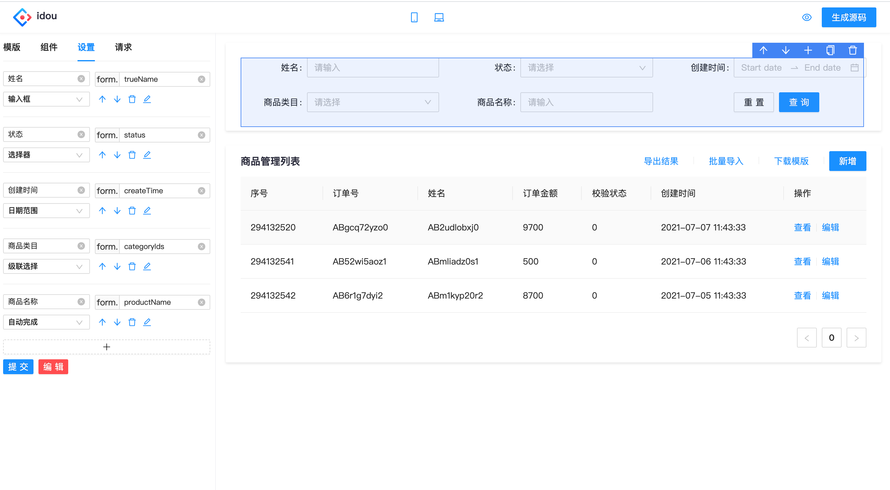

# idou

[简体中文](./README.md) | English

The idou（idol）project is a low-code development platform. Through configuration, the final output is vue2 source code, which can also be understood as a code generator. 
https://idou100.netlify.app


### Start

install
```bash
$ yarn
```

start serve

```bash
$ yarn start
```

### Usage
Applicable scenarios: background management projects, traditional development mode, use vue

In fact, idou（idol）is just an implementation in the builder. It belongs to non-runtime and has very strong flexibility and controllability. It does not conflict with the existing traditional development model, nor does it conflict with other ready-made runtime builders. , It is not an antagonistic relationship with the ready-made builders, but a supplement. If your company does not yet have a builder and uses a traditional development model, this tool will be very suitable for you.

### Automation
The idou project actually consists of two parts: a code generator and an automated source code generator.

The code generator is the interface you see, and another hidden weapon is the automated source code generator.

You can try it and run the command

```bash
$ yarn auto
```

Its core is data-driven code generation, which is based on interface data, and it is used to automatically generate our corresponding pages

At present, there is mock data. The real scenario is that the backend will define the data interface for us. We only need to grab the interface data through the crawler, judge the template page to be generated according to the interface data, and convert it into data that the platform can recognize. So as to simulate the page generated by our real environment, thus eliminating the need for us to manually configure this step.

Different companies need to modify according to their own business.

### Future plans
1）Generate multiple sets of source code (vue, react, applet, etc.), the demo for generating react has actually been implemented in the /code directory, see the generateReact.tsx file for details

2）Preview function, open codesandbox, realize online preview of the project, will give priority to upgrading to vue3, because codesandbox does not support vue2 temporarily

3）Connect to the github warehouse and automatically upload the source code (nodejs) to form a closed loop of the entire link. In fact, the demo (https://github.com/ctq123/dslService) has been implemented, but in reality there will definitely be many problems, such as how to resolve code conflicts.

4）Decompile the source code, by importing the source code, you can decompile and get the DSL