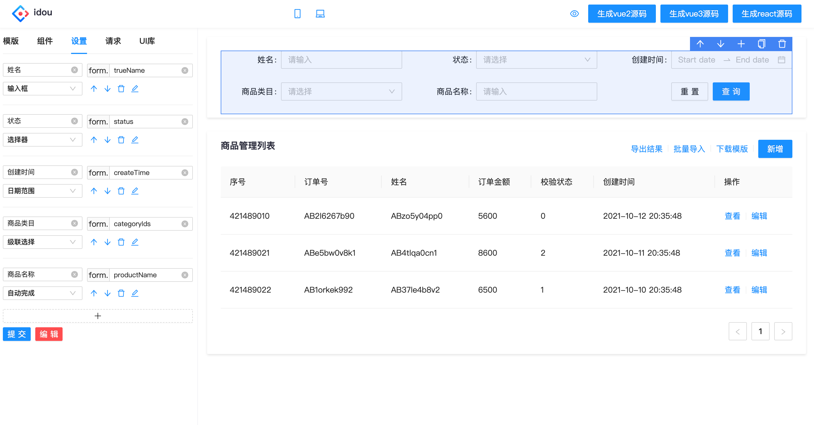

# idou

简体中文 | [English](./README-EN.md) 

idou项目是一个低代码开发平台，通过配置化，最终输出的是源码（vue2/react），也可以将它理解为代码生成器。
https://idou100.netlify.app


### 开始

安装
```bash
$ yarn
```

启动

```bash
$ yarn start
```
### 使用
适用场景：中后台，传统开发模式，vue

其实idou只是搭建器中的一种实现方式，它属于非运行时，具有非常强的灵活性和可控性，与现有的传统开发模式不冲突，与其他现成运行时的搭建器也不冲突，它与现成的搭建器不是对立的关系，而是一种补充。如果你们公司没有还不具备搭建器，采用的又是传统的开发模式，这个工具将非常适合你。

### 自动化
idou项目其实由两部分组成：代码生成器和自动化源码生成器。

代码生成器就是你所看到的界面，另一个隐藏的利器是自动化源码生成器。

你可以尝试一下运行一下命令

```bash
$ yarn auto
```

它的核心是数据驱动生成代码，也就是以接口数据为核心，适用它自动生成我们对应的页面

目前里面是mock数据，真正的场景是后端会定义好数据接口给我们，我们只要通过爬虫抓取到接口数据，根据接口数据判断要生成的模版页面，同时转换成平台能识别到的数据，从而模拟我们真实环境生成的页面，从而省去我们手动配置这一步。

当然，需要根据结合自身的业务去修改。

### 未来可能的规划
1）UI库的选择，允许用户引入其他UI库

2）预览功能，打通codesandbox，实现项目的在线预览

3）允许增加自定义的模版，除了四表一局（列表，表格，表单，图表，布局）扩展外，希望能处理增加自定义模版

4）增加物料市场管理，实现物料共享和编辑，服务拆分，需要支持vscode插件

5）接通github仓库，自动上传源码（nodejs），形成整条链路的闭环。[已实现demo](https://github.com/ctq123/dslService)，但现实中肯定会遇到很多问题，比如如何解决代码冲突的问题。

6）改善UI交互


